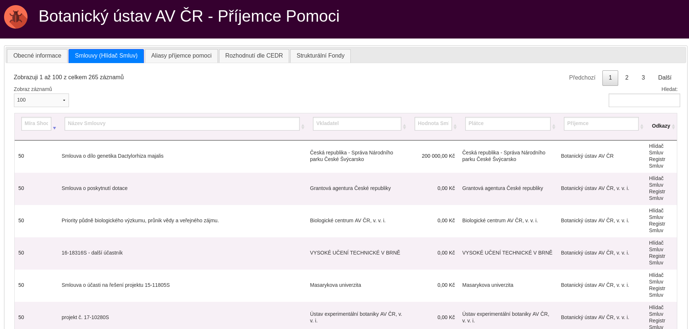

# hlidacsmluv-dotace
Projekt umožňuje podle zadaných identifikátorů o dotacích dohledat záznamy v regisru smluv

## O projektu
Projekt vznikl během 24 hodinového [hackathonu](https://www.nku.cz/hackathon/) pořádaného [Nejvyšším Kontrolním Úřadem](https://nku.cz/) 15. - 16. září 2017
ve spolupráci s Markem Seberou (@smarek).

Autoři
* Josef Ludvíček (@jludvice)
* Marek Sebera (@smarek) 

## Cíl projektu

Cílem projektu je poskytnout API pro vyhledávání smluv k dotacím vy aplikaci https://countdown.dotacni-parazit.cz.




## Zdroj Dat
Data o smlouvách jsou vyhledávána prostřednictvím API vystaveného na serveru https://www.hlidacsmluv.cz/.  
Velké díky patří [Michalu Bláhovi](http://michalblaha.cz/) za poskytnutí vyhledávacího api na Hlídači Smluv.


## Použití

Před spuštění je třeba vyplnit přístupový přístupový token.  
Ten lze získat na adrese https://www.hlidacsmluv.cz/api/v1.  
Získaný token lze vložit do `application.properties` nebo exportovat jako proměnnou prostředí (`export HLIDACSMLUV_TOKEN=lasdjflsakjfdlksajfd`).


```bash
# stuhnout zdrojové kódy
git clone https://github.com/czgov/hlidacsmluv-dotace.git

# přejít do adresáře se zdrojovými kódy
cd hlidacsmluv-dotace

# sestavit jar s aplikací
gradle bootJar

# spustit aplikaci
java -jar target *.jar

# ukončit aplikaci pomocí CTRL+C
```


```bash
curl -i \
    -H "Content-Type: application/json" \
    -X POST -d '{"projektIdnetifikator":"TH02010670","ico":"24194204","podpisDatum":"2016-11-01T00:00:00"}' \
    http://localhost:8080/smlouvy/search
```
